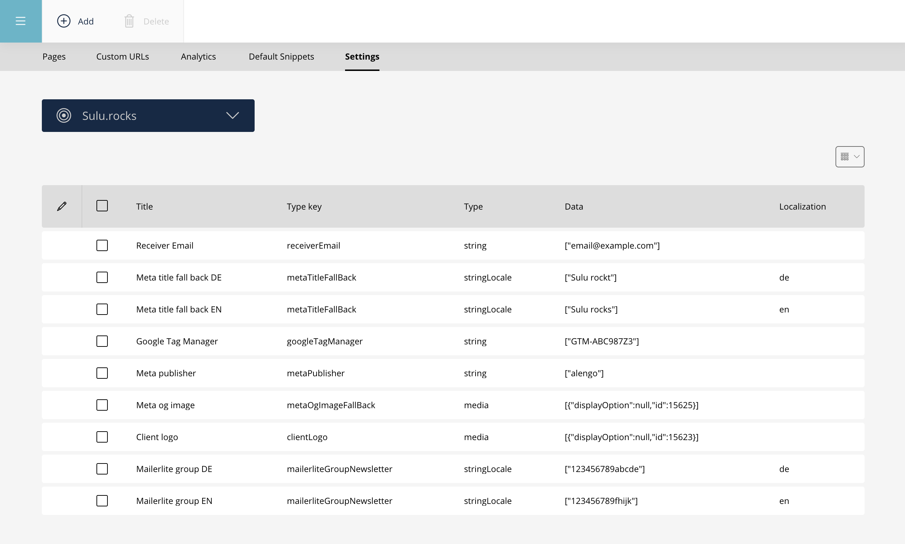

## Sulu AlengoWebspaceSettingsBundle
Sometimes you need to store values that are not directly related to a specific page or content type, but rather to the entire webspace.
This Sulu bundle provides a way to manage such settings in a structured manner.



### Requirements

* PHP 8.2
* Symfony >=7.2

### Install the bundle

Execute the following [composer](https://getcomposer.org/) command

```bash
composer require alengo/alengo-webspace-settings-bundle
```

### Enable the bundle

Enable the bundle by adding it to the list of registered bundles in the `config/bundles.php` file of your project:

 ```php
 return [
     /* ... */
     Alengo\Bundle\AlengoWebspaceSettingsBundle\AlengoWebspaceSettingsBundle::class => ['all' => true],
 ];
 ```

```bash
bin/console do:sch:up --force
```

### Configure the Bundle

Set the following config in your routes_admin.yaml

 ```yaml
alengo_webspace_settings_api:
    type: attribute
    resource: Alengo\Bundle\AlengoWebspaceSettingsBundle\Controller\Admin\WebspaceSettingsController
    prefix: /admin/api
    name_prefix: alengo_webspace_settings.
 ```
Make sure you've set the correct permissions in the Sulu backend for this bundle!
`Settings > User Roles`

### Type Selection

Set the property types you want to provide.

config/packages/alengo_webspace_settings.yaml

```yaml
alengo_webspace_settings:
    type_select:
        - 'blocks'
        - 'category'
        - 'categories'
        - 'checkbox'
        - 'collection'
        - 'collections'
        - 'contact'
        - 'contacts'
        - 'date'
        - 'dateTime'
        - 'event'
        - 'media'
        - 'medias'
        - 'account'
        - 'accounts'
        - 'page'
        - 'pages'
        - 'snippet'
        - 'snippets'
        - 'string' # default type
        - 'tags'
        - 'time'
        - 'textArea'
        - 'textEditor'
```
or execute the following command to copy it automatically:
```bash
bin/console webspace:settings:copy-config
```

### Twig Extension
The bundle provides a Twig extension to render the webspace settings in your templates.
You can use the `webspaceSettings` function to retrieve the settings for a specific webspace and typeKey.

```twig
{{ webspaceSettings('metaPublisher') }}
```
with localization

```twig
{{ webspaceSettings('metaTitleFallBack', app.request.locale) }}
```

### Blocks
The bundle supports blocks for webspace settings. Copy the [webspace_settings_blocks.xml](https://github.com/alengodev/alengoWebspaceSettingsBundle/blob/main/Resources/app/config/templates/settings/webspace_settings_blocks.xml) in your project to the following path:
```
config/templates/settings/webspace_settings_blocks.xml
```
or execute the following command to copy it automatically:
```bash
bin/console webspace:settings:copy-config
```
Adjust the blocks as needed in your project.

### Events
The bundle dispatches the following events:
- `WebspaceSettingsCreatedEvent`
- `WebspaceSettingsUpdatedEvent`

Create an event listener in your project to listen to these events and perform any necessary actions when webspace settings are created or updated.
It is recommended to use the settings type `Event`.

### Upgrade
Please read the [UPGRADE.md](UPGRADE.md) file for upgrade instructions.